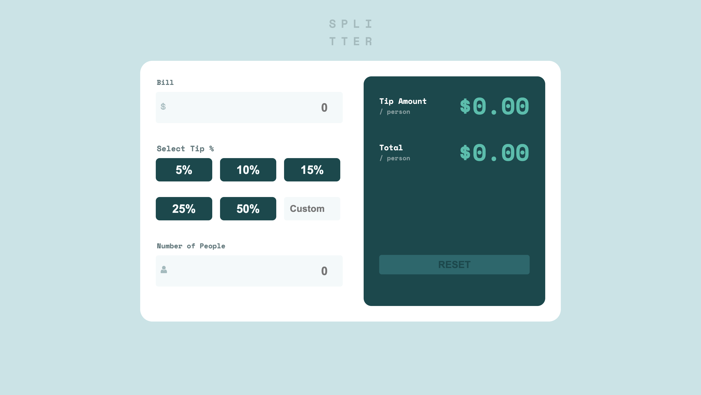

# 💸 Tip Calculator App

A responsive **Tip Calculator App**
- Built using **HTML**, **CSS**, and **JavaScript**.
- This tool allows users to easily calculate how much to tip and split the bill between multiple people.



---

## 🚀 Features

- Input total bill amount
- Select or enter custom tip percentage
- Enter number of people to split the bill
- See per person tip amount and total
- Reset the form
- Fully responsive design
- Styled with custom CSS and Google Fonts

---

## 📁 Project Structure

```

tip-calculator-app/
│
├── images/                  # Icons and favicon
├── index.html               # Main HTML file
├── style.css                # Styling (CSS)
├── script.js                # JavaScript logic
└── README.md                # Project documentation

```

---

## 📷 Preview

> You can open `index.html` in your browser to use the calculator.

---

## 🛠️ Technologies Used

- **HTML5** – Structure and layout
- **CSS3** – Styling and responsive layout
- **JavaScript (ES6+)** – Functionality and interactivity
- **Google Fonts** – Space Mono font

---

## ✅ How to Use

1. Clone the repository or download the files.
2. Open `index.html` in your browser.
3. Enter the bill amount.
4. Select a tip percentage or enter a custom one.
5. Enter the number of people.
6. View calculated tip and total per person.
7. Use the **Reset** button to start over.

---

## 🖌️ Customization

Feel free to:

- Change color themes in `style.css`
- Improve accessibility and ARIA labels
- Add dark mode support
- Enhance form validations

---

## 📄 License

This project is open-source and available for any use or modification.

---

## ✨ Author

**Your Name Here**

- GitHub: [yourusername](https://github.com/yourusername)
- LinkedIn: [yourlinkedin](https://linkedin.com/in/yourlinkedin)

---

Enjoy calculating tips like a pro! 💵
```
# Tip-Calculator-App
